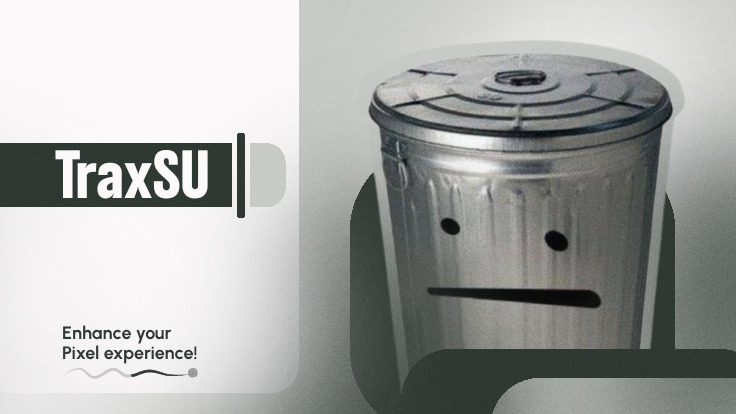

  

  

### 📝 Sum About Me

👨‍💻 Starter developer looking forward to improve and acknowledge more stuff

📱 Focused on Android development

📚 Learning a bit of Python and Android internals

---

### 🛠️ Tools & Stuff

<table align="center">
  <tr>
    <td align="center"><b>Core</b></td>
    <td align="center"><b>Languages</b></td>
    <td align="center"><b>Tools</b></td>
  </tr>
  <tr>
    <td align="center"></td>
    <td align="center"></td>
    <td align="center"></td>
  </tr>
</table>

---

### 💬 Contacts

  
  

---

### 🔥 GitHub Stats

  

  
---

### ⭐ Featured

🎀 Check out the pins to see what i'm proud of.

---

> “Treat your system as family.”
>
> 
